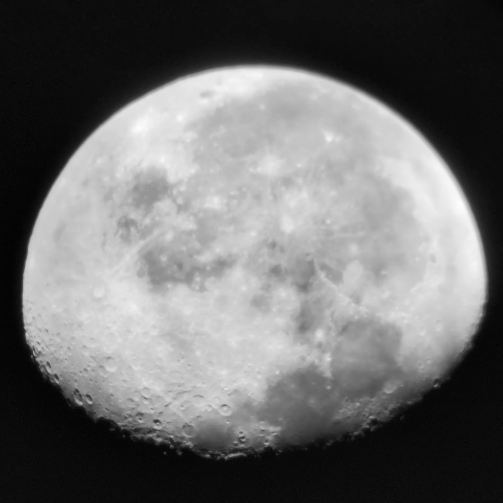
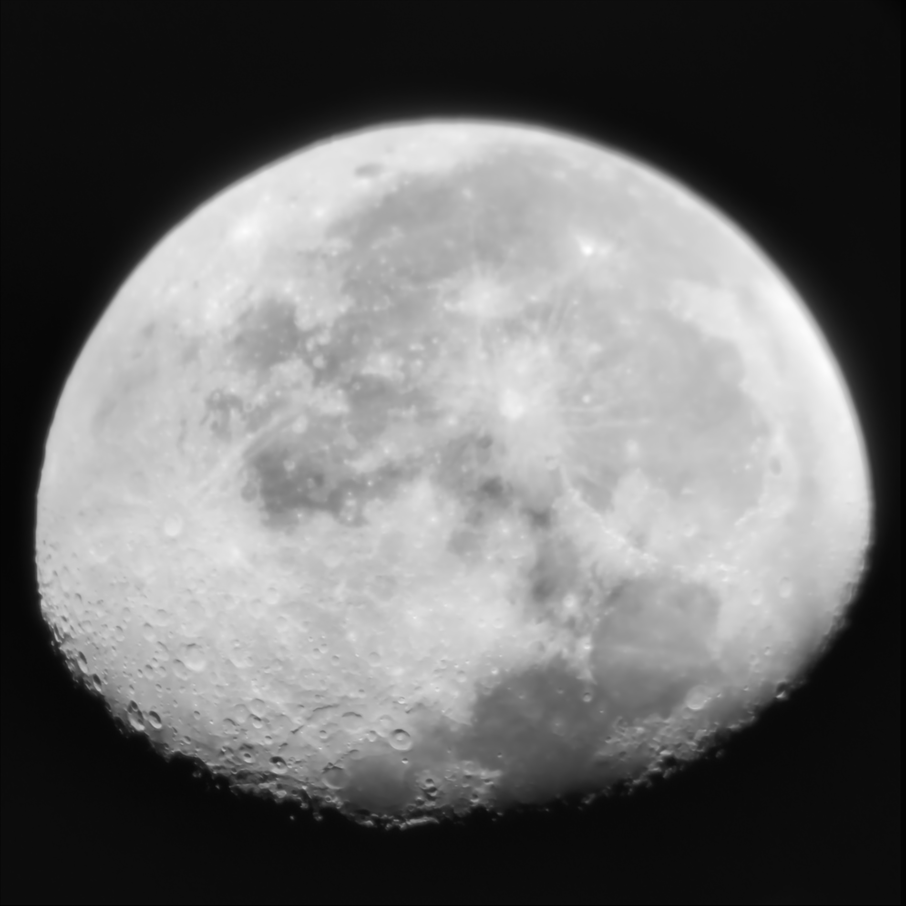
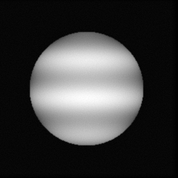
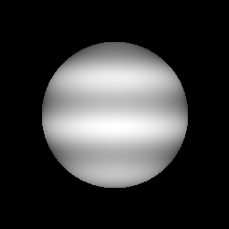

# PhotoSharp

> Lucky-imaging stacking for planetary & lunar astrophotography — one clean frame from a shaky burst.

You point a telescope at Saturn, record a minute of 4K through a phone adapter, and almost
every frame is smeared by the atmosphere. **PhotoSharp** grades the whole burst, keeps the
sharpest frames, aligns them sub-pixel, stacks them to beat down noise, and sharpens the
result — turning a wobbly video into the still, detailed image you actually saw at the
eyepiece.

It is the open-source, native, *maintained* alternative to the classic but abandoned
PIPP → AutoStakkert! → RegiStax toolchain: one tool, no antivirus headaches, yours to
extend.

## A real Moon, from a phone through the eyepiece

A hand-held 4K phone clip down a telescope on a manual mount, so the Moon drifts the whole
time. PhotoSharp decoded it, auto-tracked and cropped the disk frame by frame, graded all of
them and stacked the sharpest 55 of 180 — crisper maria, crater detail along the terminator,
Tycho's ray system, less noise:

| One raw frame | PhotoSharp — 55 frames stacked |
|:---:|:---:|
|  |  |

The honest limit, in one line: a sharp result needs detail in the capture. Point it at a
focused, well-exposed target and it pulls that detail out; point it at an over-exposed blur
and you get a cleaner blur. The software is ready — the rest is the capture.

## The result

The bundled `demo` (no telescope required) simulates 200 jittered, blurred, noisy frames
of a planet and recovers a clean image — a **measured 4.9× drop in background noise** from
stacking the 61 sharpest frames:

| One raw frame | PhotoSharp (stacked) | Ground truth |
|:---:|:---:|:---:|
|  |  |  |

The grain on the left is what a single frame gives you; the middle is what grading,
aligning, stacking and sharpening recover. On a real Saturn or Jupiter capture the same
pipeline pulls the rings and cloud bands out of a shaky 4K video — Phase 2 wires in the
video decode so you can point it straight at your own footage.

## How it works

```
decode → grade (sharpness) → keep sharpest % → align (FFT) → stack → sharpen → export
```

The technique is **lucky imaging**, with the luck removed: instead of hoping for a good
frame, PhotoSharp scores every frame by the **variance of its Laplacian** (a deterministic
sharpness metric), keeps only the best, and registers them with **phase correlation** (the
FFT cross-power spectrum) before stacking. Stacking N frames lifts the signal-to-noise
ratio by ~√N; a final unsharp mask restores the detail the atmosphere softened.

## Status

**Phases 1–2 work and are verified.** The lucky-imaging core (grade/align/stack/sharpen) plus
video input: point it at an MP4/MOV and it streams frames through `ffmpeg`, auto-crops the
planet, and stacks — verified end to end on a real (h264) video. A synthetic `demo` runs with
no data at all.

| Phase | Scope | State |
|-------|-------|-------|
| 1 | grade · align · stack · sharpen · CLI · synthetic demo | ✅ done |
| 2 | video decode via `ffmpeg` + per-frame planet auto-crop (`--video`) | ✅ done |
| 3 | native `egui` GUI (load, tune, preview, export) | planned |
| 4 | CUDA path · 16-bit TIFF · drizzle · sub-pixel · batch | planned |

See [`docs/ADR-0001-architecture.md`](docs/ADR-0001-architecture.md) for the design and its
trade-offs.

## Try it (no telescope needed)

```bash
cargo run --release -p photosharp-cli -- demo --frames 200 --out-prefix demo
```

This generates a synthetic planet, simulates 200 jittered/blurred/noisy frames, and writes
`demo-single.png` (one raw frame) next to `demo-stacked.png` (the recovered result) so you
can see what stacking buys you.

On your own capture — point it straight at the video (decoded via `ffmpeg`, planet auto-cropped):

```bash
cargo run --release -p photosharp-cli -- stack --video saturn.mp4 --roi 512 --keep 0.3 --stretch --out saturn.png
```

Or on a folder of already-exported frames (PNG/JPEG/TIFF):

```bash
cargo run --release -p photosharp-cli -- stack --input ./frames --keep 0.3 --stretch --out saturn.png
```

## Build

```bash
cargo build --release
cargo test
```

Pure Rust core. Video input (`--video`) shells out to `ffmpeg`/`ffprobe` — the standard native
video layer; install it (e.g. `winget install ffmpeg`) for that path. The synthetic `demo` and
the `--input` folder mode need nothing but Rust.

## Licence

MIT — see [LICENSE](LICENSE). Built to be made yours.
